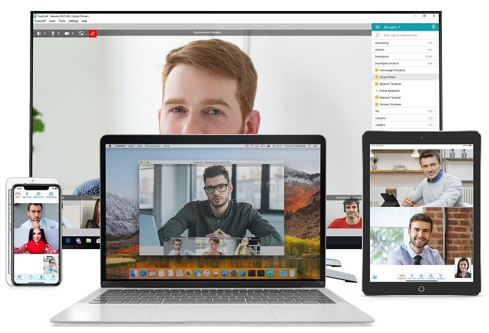
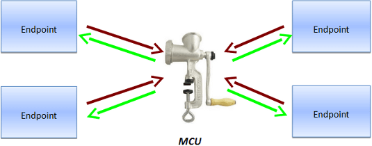
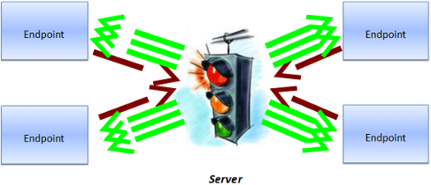
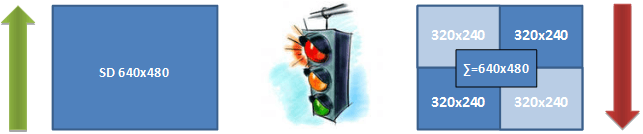
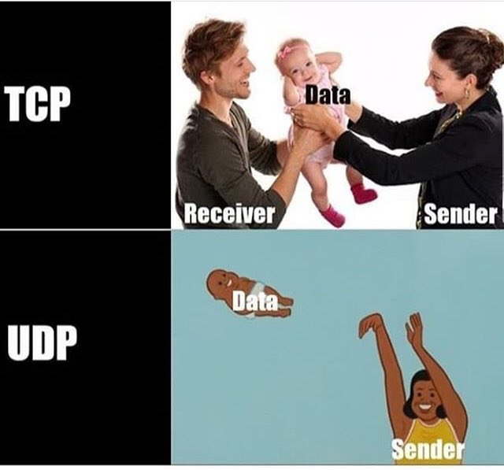

# video-conferencing-design
Software design for Video conferencing application such as Zoom, webex, whatspp
Let us discuss the design.

First things first, let’s lock down the requirements.
# Functional Requirement

- The system must support 1-to-1 calls
- The system must support group calls
- Calls can be audio or video or screen sharing
- Should offer a call recording feature

Note: Screen share will be an extension of video call itself, only in case of video call the source of the video is the camera, whereas in screen share source of the video will be the screen.

# Non Functional Requirements
- Should be super fast - low latency is not enough
- High availability
- Data loss is OK

# Video Conferencing Server Architecture
## Hardware solutions
Hardware solutions are often based on modules with DSP-processors to support massive computing. The solutions’ capacity may be increased by adding new modules. Such solutions are more expensive.
Work Principles of Classical Hardware Video Conferencing Server

MCU (Multipoint Control Unit) accepts video streams from each terminal, decodes and mixes them into one stream, then it encodes and sends the stream to each endpoint.

## Architecture of Software Video Conferencing Solutions
Software solutions come in various types:
- Client-server solutions, in which communication between endpoints is carried out through a single server. This is a centralized system with good controllability. High reliability of such systems is achieved by duplicating servers. The disadvantage is that all data goes through a single server and the quality of communication depends on the location of the server.
- P2P solutions (peer-to-peer). This is a decentralized system that has high reliability but low controllability. Traffic is routed through various network nodes and connection points (usually endpoints). The disadvantage is that the communication quality may vary along the data path and also depends on the capacity of the nodes.
- Hybrid solutions combine the advantages of the previous types. The endpoints either exchange traffic directly or via a server, depending on the state of communication channels.

Classical Architecture of PC-Based Video Conferencing

Software platform in such system interchanges incoming streams from participants, replicates them according to the number of receiving participants and sends to each user.For example, in a symmetric group conference with 4 participants a user who sends video with 640×360 resolution (SD – standard definition), will receive video with resolution of 4x(640×360) = 1280×720 (HD – High Definition).

The user receives the maximum resolution, the sum of the resolutions of all participants of a group video conference. 

Improved Architecture of PC-Based Video Conferencing Without Transcoding
Scalable video coding (SVC) technology allows each participant to get the picture, adapted to his/her endpoint. For example, if the endpoint is a smartphone with a 800×480 screen, the 1280×720 resolution would be excessive and so the server reduces the resolution of video streams.

# Lets get technical 
## TCP? UDP? Both!!

UDP is fast

