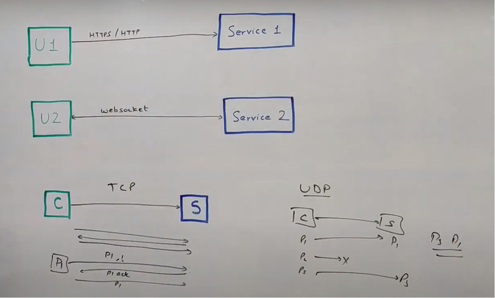
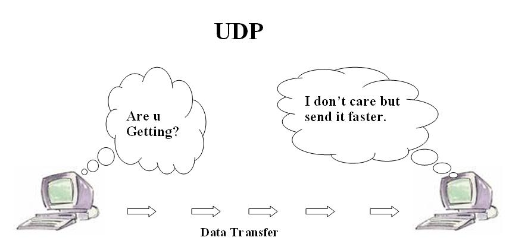
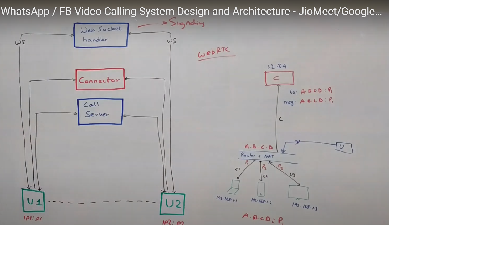
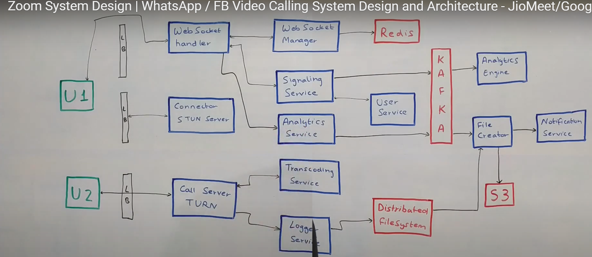
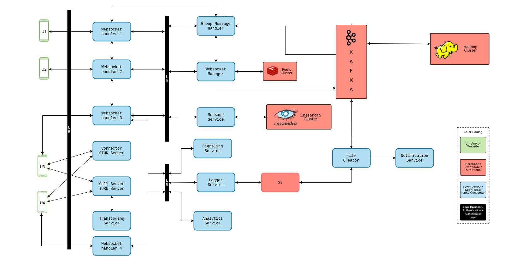

# video-conferencing-design
Software design for Video conferencing application such as Zoom, webex, whatspp. Let us discuss the design.

First things first, let’s lock down the requirements.
# Functional Requirement

- The system must support 1-to-1 calls
- The system must support group calls
- Calls can be audio or video or screen sharing
- Should offer a call recording feature

Note: Screen share will be an extension of video call itself, only in case of video call the source of the video is the camera, whereas in screen share source of the video will be the screen.

# Non Functional Requirements
- Should be super fast - low latency is not enough
- High availability
- Data loss is OK

# Video Conferencing Server Architecture
## Hardware solutions
Hardware solutions are often based on modules with DSP-processors to support massive computing. The solutions’ capacity may be increased by adding new modules. Such solutions are more expensive.
Work Principles of Classical Hardware Video Conferencing Server

MCU (Multipoint Control Unit) accepts video streams from each terminal, decodes and mixes them into one stream, then it encodes and sends the stream to each endpoint.

## Architecture of Software Video Conferencing Solutions
Software solutions come in various types:
- Client-server solutions, in which communication between endpoints is carried out through a single server. This is a centralized system with good controllability. High reliability of such systems is achieved by duplicating servers. The disadvantage is that all data goes through a single server and the quality of communication depends on the location of the server.
- P2P solutions (peer-to-peer). This is a decentralized system that has high reliability but low controllability. Traffic is routed through various network nodes and connection points (usually endpoints). The disadvantage is that the communication quality may vary along the data path and also depends on the capacity of the nodes.
- Hybrid solutions combine the advantages of the previous types. The endpoints either exchange traffic directly or via a server, depending on the state of communication channels.

Classical Architecture of PC-Based Video Conferencing

Software platform in such system interchanges incoming streams from participants, replicates them according to the number of receiving participants and sends to each user.For example, in a symmetric group conference with 4 participants a user who sends video with 640×360 resolution (SD – standard definition), will receive video with resolution of 4x(640×360) = 1280×720 (HD – High Definition).

The user receives the maximum resolution, the sum of the resolutions of all participants of a group video conference. 

Improved Architecture of PC-Based Video Conferencing Without Transcoding
Scalable video coding (SVC) technology allows each participant to get the picture, adapted to his/her endpoint. For example, if the endpoint is a smartphone with a 800×480 screen, the 1280×720 resolution would be excessive and so the server reduces the resolution of video streams.

# Lets get technical 
## TCP? UDP? Both!!

Unlike TCP, in UDP there is no requirement to form a connection. As long as the devices are aware of each other’s public IP address, they can talk via peer to peer connection. Also, as it is known, UDP is a lossy protocol, which means there is no concept of acknowledgment in UDP. If the sender sends packets P1, P2, P3, and P4 but the receiver only receives packets P1, P3, and P4, the sender won’t bother sending P2 again i.e. there might be some data loss.
UDP is fast

But for our system using just UDP will not be enough. We will be using a combination of TCP and UDP. All the API calls, all communication between components, etc will happen over TCP but all video transfer will happen over UDP.

Now let us understand exactly how the whole video call will take place with an example. Say U1 wants to initiate a call with U2 but U2 is offline. In this case, you can decide how to let U1 know about U2 being unavailable. But when U2 is online, a web socket handler will send a message to U2 that U1 wishes to call them and if they want to accept. Whatever U2 decides will be communicated to U1 using the same route. Now this whole connection between U1 and U2 via web socket handler is a TCP connection. But for the video call, we need to move to a UDP connection. So how do we establish a UDP connection between U1 and U2?

Establishing the UDP connection requires the public IP addresses of both parties.

Refer to this diagram, we will understand with this example of how the private IP address will be used to find the public IP address of the device. Suppose we have D1, D2, and D2 connected to a series of routers which in the end have a router with a public IP address and a NAT in the same layer. Let’s say the public IP address of this router is A.B.C.D and devices D1, D2 and D3 are connected at ports P1, P2, and P3 respectively. So when D1 connects to our connector, as far as the connector is concerned, a request is coming from A.B.C.D: P1 which becomes the public address of D1 and it will respond to D1 with public IP address A.B.C.D: P1. In this manner, U1 and U2 will get three public IPs from the connector and then communicate it to each other using the Web socket handler.

## Comlexity and WebRTC
- Devices can be on different bandwidth
- A public IP may also change during the call.
- Bandwidth is dynamic.
- Need a smart client.

Here we will introduce something called Call Server between U1 and U2. Call servers can do the job of a connector as well as facilitate data transfer. Now the ports for U1 and U2 will be identified by the call server and from then on it will start acting as an intermediate between U1 and U2. U1 will send its data to be forwarded to U2 and U2 will communicate with U1 in a similar fashion. This whole process or protocol is known as WebRTC.

# System Architecture

# Transcoding
Again, the next question is, how will this work for a group video call? This is where it gets a little tricky. In a group call, we will need to do some transcoding before sending the data packets to various users. Since our users will be connecting from different kinds of devices, they will be supporting different formats, and we need to be able to send them the data in that particular format, which is where Transcoding comes in. That means we will convert the original video to support multiple formats and a variety of bandwidths, bitrates, etc. - Now let’s say, U1 is sending a video to U2 and U3, and user U3 is connected to a network with poor speed and wants a low definition call. This message will reach the call server. The call server will know that U2 can support HD videos and directly send the high-quality video to U2. It will also know that U3 needs an SD video and convert the video to a lower definition. For this, it will talk to the Transcoding Service to convert the video to SD format and send it to U3. Now, remember that transcoding is a one-way operation i.e. an HD video can be converted to that of lower definition but not the other way round. So when U3 sends a video of its own, the call server will know that it cannot be transcoded to a video of superior quality and skip the call to the transcoding service and send the data packet to U1 and U2 directly. Also, this information will be stored by the call server which will use a Redis to cache it.

# Recording Feature
Now let’s go back to that recording feature. As discussed before, if we want the call to be recorded the call must be routed through the call server. When U1 sends a data packet to the call server, it is forwarded to U2 and also to a logger service. Logger service aggregates these data chunks and sends them to a distributed file system to be stored against a meeting id. The distributed system will only hold this data for as long as the call is on. Once the call is disconnected signaling service will know through the web socket handler and fire an event to Kafka. The next component that comes into play here is a File creator (you can also call it an archiving service).

When Kafka receives an event that call has been disconnected, File creator will listen to it, fetch all the chunks for data for that meeting id from the distributed file system and compile them into a video. This video will then be stored in a permanent data store like S3. Once this file is created the Notification Center will send out a notification to all involved users that this file is available for them to view.

# How intelligent is the client?
This is the next big question. Exactly what operations can the client perform independently? Going back to the U1-U2 video call, we know that our clients are smart enough to know their limitations like bandwidth, bitrate, resolution, etc, and communicate to the other party and come up with a configuration for the call that works for both of them. Now let’s say while U1 and U2 are in a peer to peer call, U1’s public IP keeps changing or the call keeps getting dropped. In such a case our clients will be smart enough to mutually decide that their p-to-p connection is not working and they need to move to the call server model. This will all happen at run time. Also, this switch won’t necessarily happen at the same time. U1 could be sending messages to U2 directly and U2 could be sent through the call server. Even in a group call, the same flow will apply.

# References
https://www.codekarle.com/system-design/Zoom-system-design.html

https://www.codekarle.com/system-design/Whatsapp-system-design.html

https://www.youtube.com/watch?v=G32ThJakeHk

https://trueconf.com/blog/reviews-comparisons/videoconferencing-systems-architecture.html

